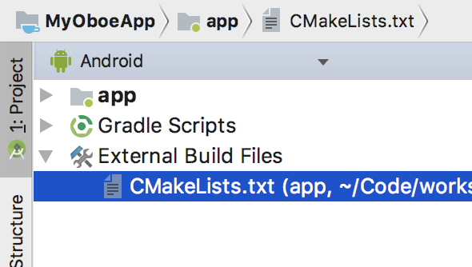

# Getting Started
The easiest way to start using Oboe is to build it from source by adding a few steps to an existing Android Studio project.

## Adding Oboe to your project

### 1. Clone the github repository 
Start by cloning the Oboe repository: 

    git clone https://github.com/google/oboe

**Make a note of the path which you cloned oboe into - you will need it shortly**

### 2. Update CMakeLists.txt
Open your app's `CMakeLists.txt`. This can be found under `External Build Files` in the Android project view. 

Now add the following commands to the end of `CMakeLists.txt`. **Remember to update `**PATH TO OBOE**` with your local Oboe path from the previous step**:

    # Set the path to the Oboe directory.
    set (OBOE_DIR ***PATH TO OBOE***) 
    
    # Add the Oboe library as a subdirectory in your project.
    add_subdirectory (${OBOE_DIR} ./oboe) 
    
    # Specify the path to the Oboe header files.
    include_directories (${OBOE_DIR}/include)  

In the same file find the [`target_link_libraries`](https://cmake.org/cmake/help/latest/command/target_link_libraries.html) command. 
Add `oboe` to the list of libraries which your app's library depends on. For example:

    target_link_libraries(native-lib oboe)

Here's a complete example `CMakeLists.txt` file:

    cmake_minimum_required(VERSION 3.4.1)

    # Build our own native library
    add_library (native-lib SHARED src/main/cpp/native-lib.cpp )

    # Specify the libraries which our native library is dependent on, including Oboe
    target_link_libraries (native-lib log oboe)
    
    # Build the Oboe library
    set (OBOE_DIR ../../../oboe)  
    add_subdirectory (${OBOE_DIR} ./oboe) 
    
    # Make the Oboe public headers available to our app
    include_directories (${OBOE_DIR}/include)

Verify that your project builds correctly. If you have any issues building please [report them here](issues/new).

# Using Oboe
Once you've added Oboe to your project you can start using Oboe's features. The simplest, and probably most common thing you'll do in Oboe is to create an audio stream. 

## Creating an audio stream
Include the Oboe header:

    #include <oboe/Oboe.h>

Streams are built using an `AudioStreamBuilder`. Create one like this:

    oboe::AudioStreamBuilder builder;

Use the builder's set methods to set properties on the stream (you can read more about these properties in the [full guide](FullGuide.md)):

    builder.setDirection(oboe::Direction::Output);
    builder.setPerformanceMode(oboe::PerformanceMode::LowLatency);
    builder.setSharingMode(oboe::SharingMode::Exclusive);

Define an `AudioStreamCallback` class to receive callbacks whenever the stream requires new data.

    class MyCallback : public oboe::AudioStreamCallback {
    public:
        oboe::DataCallbackResult
        onAudioReady(oboe::AudioStream *audioStream, void *audioData, int32_t numFrames){
            generateSineWave(static_cast<float *>(audioData), numFrames);
            return oboe::DataCallbackResult::Continue;
        }
    };

Supply this callback class to the builder:

    MyCallback myCallback;
    builder.setCallback(&myCallback);

Open the stream:

    oboe::AudioStream *stream;
    oboe::Result result = builder.openStream(&stream);

Check the result to make sure the stream was opened successfully. Oboe has a convenience method for converting its types into human-readable strings called `oboe::convertToText`:

    if (result != Result::OK){
        LOGE("Failed to create stream. Error: %s", oboe::convertToText(result));
    }

Note that this sample code uses the [logging macros from here](https://github.com/googlesamples/android-audio-high-performance/blob/master/debug-utils/logging_macros.h).

Check the properties of the created stream. The **format** is one property which you should check. The default is `float` on API 21+ and `int16_t` on API 20 or lower. This will dictate the `audioData` type in the `AudioStreamCallback::onAudioReady` callback.

    oboe::AudioFormat format = stream->getFormat();
    LOGI("AudioStream format is %s", oboe::convertToText(format));

Now start the stream. 

    stream->requestStart();

At this point you should start receiving callbacks.

When you are done with the stream you should close it:

    stream->close();

Note that `close()` is a blocking call which also stops the stream.

## Further information
- [Code samples](https://github.com/googlesamples/android-audio-high-performance/tree/master/oboe)
- [Full guide to Oboe](FullGuide.md)
