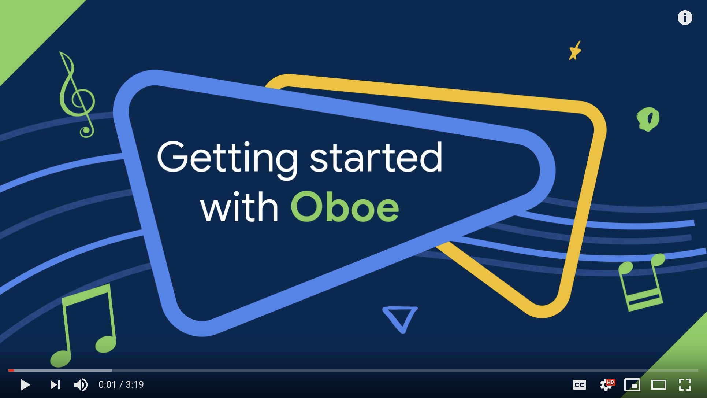

# Oboe 

Oboe is a C++ library which makes it easy to build high-performance audio apps on Android. It was created primarily to allow developers to target a simplified API that works across multiple API levels back to API level 16 (Jelly Bean).

## Features
- Compatible with API 16 onwards - runs on 99% of Android devices
- Chooses the audio API (OpenSL ES on API 16+ or AAudio on API 27+) which will give the best audio performance on the target Android device
- Automatic latency tuning
- Modern C++ allowing you to write clean, elegant code
- [Used by popular apps and frameworks](docs/AppsUsingOboe.md)

## Requirements
To build Oboe you will need the Android NDK r17 or above. It can be installed using Android Studio's SDK manager, or via [direct download](https://developer.android.com/ndk/downloads/).

## Documentation
- [Getting Started Guide](docs/GettingStarted.md)
- [Full Guide to Oboe](docs/FullGuide.md)
- [API reference](https://google.github.io/oboe/reference)
- [History of Audio features/bugs by Android version](docs/AndroidAudioHistory.md)
- [Frequently Asked Questions](docs/FAQ.md) (FAQ)
- [Our roadmap](https://github.com/google/oboe/milestones) - Vote on a feature/issue by adding a thumbs up to the first comment 

## Sample code
Sample apps can be found in the [samples directory](samples). Also check out the [Rhythm Game codelab](https://codelabs.developers.google.com/codelabs/musicalgame-using-oboe/index.html#0).

### Third party sample code
- [Ableton Link integration demo](https://github.com/jbloit/AndroidLinkAudio) (author: jbloit)

## Contributing
We would love to receive your pull requests. Before we can though, please read the [contributing](CONTRIBUTING.md) guidelines.

## Version history
View the [releases page](../../releases).

## License
[LICENSE](LICENSE)

