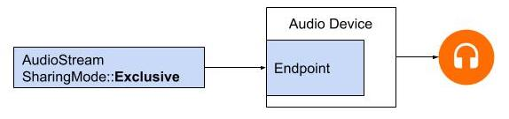
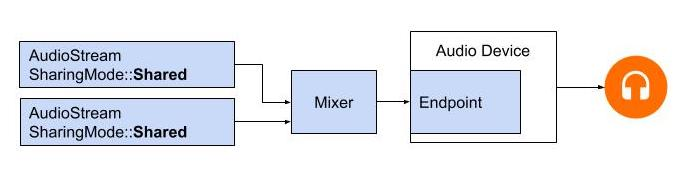

# Full Guide To Oboe
Oboe is a C++ library which makes it easy to build high-performance audio apps on Android. Apps communicate with Oboe by reading and writing data to streams.

## Audio streams

Oboe moves audio data between your app and the audio inputs and outputs on your Android device. Your app passes data in and out using a callback function or by reading from and writing to *audio streams*, represented by the class `AudioStream`. The read/write calls can be blocking or non-blocking.

A stream is defined by the following:

*   The *audio* *device* that is the source or sink for the data in the stream.
*   The *sharing mode* that determines whether a stream has exclusive access to an audio device that might otherwise be shared among multiple streams.
*   The *format* of the audio data in the stream.

### Audio device

Each stream is attached to a single audio device.

An audio device is a hardware interface or virtual endpoint that acts as a source or sink for a continuous stream of digital audio data. Don't confuse an *audio device*
(a built-in mic or bluetooth headset) with the *Android device* (the phone or watch) that is running your app.

On API 23 and above you can use the `AudioManager` method [getDevices()](https://developer.android.com/reference/android/media/AudioManager.html#getDevices(int)) to discover the audio devices that are available on your Android device. The method returns information about the [type](https://developer.android.com/reference/android/media/AudioDeviceInfo.html) of each device.

Each audio device has a unique ID on the Android device. You can  use the ID to bind an audio stream to a specific audio device.  However, in most cases you can let Oboe choose the default primary device rather than specifying one yourself.

The audio device attached to a stream determines whether the stream is for input or output. A stream can only move data in one direction. When you define a stream you also set its direction. When you open a stream Android checks to ensure that the audio device and stream direction agree.

### Sharing mode

A stream has a sharing mode:

*   `SharingMode::Exclusive` (available on API 26+) means the stream has exclusive access to an endpoint on its audio device; the endpoint cannot be used by any other audio stream. If the exclusive endpoint is already in use, it might not be possible for the stream to obtain access to it. Exclusive streams provide the lowest possible latency by bypassing the mixer stage, but they are also more likely to get disconnected. You should close exclusive streams as soon as you no longer need them, so that other apps can access that endpoint. Not all audio devices provide exclusive endpoints. System sounds and sounds from other apps can still be heard when an exclusive stream is in use as they use a different endpoint.



*   `SharingMode::Shared` allows Oboe streams to share an endpoint. The operating system will mix all the shared streams assigned to the same endpoint on the audio device.




You can explicitly request the sharing mode when you create a stream, although you are not guaranteed to receive that mode. By default, the sharing mode is `Shared`.

### Audio format

The data passed through a stream has the usual digital audio attributes, which you must specify when you define a stream. These are as follows:

*   Sample format
*   Samples per frame
*   Sample rate

Oboe permits these sample formats:

| AudioFormat | C data type | Notes |
| :------------ | :---------- | :---- |
| I16 | int16_t | common 16-bit samples, [Q0.15 format](https://source.android.com/devices/audio/data_formats#androidFormats) |
| Float | float | -1.0 to +1.0 |

Oboe might perform sample conversion on its own. For example, if an app is writing AudioFormat::Float data but the HAL uses AudioFormat::I16, Oboe might convert the samples automatically. Conversion can happen in either direction. If your app processes audio input, it is wise to verify the input format and be prepared to convert data if necessary, as in this example:

    AudioFormat dataFormat = stream->getDataFormat();
    //... later
    if (dataFormat == AudioFormat::I16) {
         convertFloatToPcm16(...)
    }

## Creating an audio stream

The Oboe library follows a [builder design pattern](https://en.wikipedia.org/wiki/Builder_pattern) and provides the class `AudioStreamBuilder`.

### Set the audio stream configuration using an AudioStreamBuilder.

Use the builder functions that correspond to the stream parameters. These optional set functions are available:

    AudioStreamBuilder streamBuilder;

    streamBuilder.setDeviceId(deviceId);
    streamBuilder.setDirection(direction);
    streamBuilder.setSharingMode(shareMode);
    streamBuilder.setSampleRate(sampleRate);
    streamBuilder.setChannelCount(channelCount);
    streamBuilder.setFormat(format);
    streamBuilder.setPerformanceMode(perfMode);

Note that these methods do not report errors, such as an undefined constant or value out of range. They will be checked when the stream is opened.

If you do not specify the deviceId, the default is the primary output device.
If you do not specify the stream direction, the default is an output stream.
For all parameters, you can explicitly set a value, or let the system
assign the optimal value by not specifying the parameter at all or setting
it to `kUnspecified`.

To be safe, check the state of the audio stream after you create it, as explained in step 3, below.

### Open the Stream

After you've configured the `AudioStreamBuilder`, call `openStream()` to open the stream:

    Result result = streamBuilder.openStream(&stream_);
    if (result != OK){
        __android_log_print(ANDROID_LOG_ERROR,
                            "AudioEngine",
                            "Error opening stream %s",
                            convertToText(result));
    }


### Verifying stream configuration and additional properties

You should verify the stream's configuration after opening it.

The following properties are guaranteed to be set. However, if these properties 
are unspecified, a default value will still be set, and should be queried by the 
appropriate accessor.

* callback 
* framesPerCallback
* sampleRate
* channelCount
* format
* direction

The following properties may be changed by the underlying stream construction
*even if explicitly set* and therefore should always be queried by the appropriate
accessor. The property settings will depend on device capabilities.

* bufferCapacityInFrames
* sharingMode (exclusive provides lowest latency)
* performanceMode 

The following properties are only set by the underlying stream. They cannot be
set by the application, but should be queried by the appropriate accessor.

* framesPerBurst

The following properties have unusual behavior

* deviceId is respected when the underlying API is AAudio (API level >=28), but not when it 
is OpenSLES. It can be set regardless, but *will not* throw an error if an OpenSLES stream 
is used. The default device will be used, rather than whatever is specified.

* mAudioApi is only a property of the builder, however
AudioStream::getAudioApi() can be used to query the underlying API which the
stream uses. The property set in the builder is not guaranteed, and in
general, the API should be chosen by Oboe to allow for best performance and
stability considerations. Since Oboe is designed to be as uniform across both
APIs as possible, this property should not generally be needed.

* mBufferSizeInFrames can only be set on an already open stream (as opposed to a
builder), since it depends on run-time behavior.
The actual size used may not be what was requested.
Oboe or the underlyng API will limit the size between zero and the buffer capacity.
It may also be limited further to reduce glitching on particular devices.
This features is not supported when using OpenSL ES callbacks.

Many of the stream's properties may vary (whether or not you set
them) depending on the capabilities of the audio device and the Android device on 
which it's running. If you need to know these values then you must query them using 
the accessor after the stream has been opened. Additionally,
the underlying parameters a stream is granted are useful to know if
they have been left unspecified. As a matter of good defensive programming, you
should check the stream's configuration before using it.


There are functions to retrieve the stream setting that corresponds to each
builder setting:


| AudioStreamBuilder set methods | AudioStream get methods |
| :------------------------ | :----------------- |
| `setCallback()` |  `getCallback()` |
| `setDirection()` | `getDirection()` |
| `setSharingMode()` | `getSharingMode()` |
| `setPerformanceMode()` | `getPerformanceMode()` |
| `setSampleRate()` | `getSampleRate()` |
| `setChannelCount()` | `getChannelCount()` |
| `setFormat()` | `getFormat()` |
| `setBufferCapacityInFrames()` | `getBufferCapacityInFrames()` |
| `setFramesPerCallback()` | `getFramesPerCallback()` |
|  --  | `getFramesPerBurst()` |
| `setDeviceId()` (not respected on OpenSLES) | `getDeviceId()` |
| `setAudioApi()` (mainly for debugging) | `getAudioApi()` |

The following AudioStreamBuilder fields were added in API 28 to
specify additional information about the AudioStream to the device. Currently, 
they have little effect on the stream, but setting them helps applications 
interact better with other services.

For more information see: [Usage/ContentTypes](https://source.android.com/devices/audio/attributes).
The InputPreset may be used by the device to process the input stream (such as gain control). By default 
it is set to VoiceRecognition, which is optimized for low latency.

* `setUsage(oboe::Usage usage)`  - The purpose for creating the stream.
* `setContentType(oboe::ContentType contentType)` - The type of content carried
  by the stream.
* `setInputPreset(oboe::InputPreset inputPreset)` - The recording configuration
  for an audio input.
* `setSessionId(SessionId sessionId)` - Allocate SessionID to connect to the
  Java AudioEffects API.


## Using an audio stream

### State transitions

An Oboe stream is usually in one of five stable states (the error state, Disconnected, is described at the end of this section):

*   Open
*   Started
*   Paused
*   Flushed
*   Stopped

Data only flows through a stream when the stream is in the Started state. To
move a stream between states, use one of the functions that request a state
transition:

    Result result;
    result = stream->requestStart();
    result = stream->requestStop();
    result = stream->requestPause();
    result = stream->requestFlush();

Note that you can only request pause or flush on an output stream:

These functions are asynchronous, and the state change doesn't happen
immediately. When you request a state change, the stream moves toone of the
corresponding transient states:

*   Starting
*   Pausing
*   Flushing
*   Stopping
*   Closing

The state diagram below shows the stable states as rounded rectangles, and the transient states as dotted rectangles.
Though it's not shown, you can call `close()` from any state


Oboe doesn't provide callbacks to alert you to state changes. One special
function,
`AudioStream::waitForStateChange()` can be used to wait for a state change.
Note that most apps will not need to call `waitForStateChange()` and can just
request state changes whenever they are needed.

The function does not detect a state change on its own, and does not wait for a
specific state. It waits until the current state
is *different* than `inputState`, which you specify.

For example, after requesting to pause, a stream should immediately enter
the transient state Pausing, and arrive sometime later at the Paused state - though there's no guarantee it will.
Since you can't wait for the Paused state, use `waitForStateChange()` to wait for *any state
other than Pausing*. Here's how that's done:

```
StreamState inputState = StreamState::Pausing;
StreamState nextState = StreamState::Uninitialized;
int64_t timeoutNanos = 100 * kNanosPerMillisecond;
result = stream->requestPause();
result = stream->waitForStateChange(inputState, &nextState, timeoutNanos);
```


If the stream's state is not Pausing (the `inputState`, which we assumed was the
current state at call time), the function returns immediately. Otherwise, it
blocks until the state is no longer Pausing or the timeout expires. When the
function returns, the parameter `nextState` shows the current state of the
stream.

You can use this same technique after calling request start, stop, or flush,
using the corresponding transient state as the inputState. Do not call
`waitForStateChange()` after calling `AudioStream::close()` since the underlying stream resources
will be deleted as soon as it closes. And do not call `close()`
while `waitForStateChange()` is running in another thread.

### Reading and writing to an audio stream

There are two ways to move data in or out of a stream.
1) Read from or write directly to the stream.
2) Specify a callback object that will get called when the stream is ready.

The callback technique offers the lowest latency performance because the callback code can run in a high priority thread.
Also, attempting to open a low latency output stream without an audio callback (with the intent to use writes)
may result in a non low latency stream.

The read/write technique may be easier when you do not need low latency. Or, when doing both input and output, it is common to use a callback for output and then just do a non-blocking read from the input stream. Then you have both the input and output data available in one high priority thread.

After the stream is started you can read or write to it using the methods
`AudioStream::read(buffer, numFrames, timeoutNanos)`
and
`AudioStream::write(buffer, numFrames, timeoutNanos)`.

For a blocking read or write that transfers the specified number of frames, set timeoutNanos greater than zero. For a non-blocking call, set timeoutNanos to zero. In this case the result is the actual number of frames transferred.

When you read input, you should verify the correct number of
frames was read. If not, the buffer might contain unknown data that could cause an
audio glitch. You can pad the buffer with zeros to create a
silent dropout:

    Result result = stream.read(audioData, numFrames, timeout);
    if (result < 0) {
        // Error!
    }
    if (result != numFrames) {
        // pad the buffer with zeros
        memset(static_cast<sample_type*>(audioData) + result * samplesPerFrame, 0,
               (numFrames - result) * stream.getBytesPerFrame());
    }

You can prime the stream's buffer before starting the stream by writing data or silence into it. This must be done in a non-blocking call with timeoutNanos set to zero.

The data in the buffer must match the data format returned by `stream.getDataFormat()`.

### Closing an audio stream

When you are finished using a stream, close it:

    stream->close();

Do not close a stream while it is being written to or read from another thread as this will cause your app to crash. After you close a stream you should not call any of its methods except for quering it properties.

### Disconnected audio stream

An audio stream can become disconnected at any time if one of these events happens:

*   The associated audio device is no longer connected (for example when headphones are unplugged).
*   An error occurs internally.
*   An audio device is no longer the primary audio device.

When a stream is disconnected, it has the state "Disconnected" and calls to `write()` or other functions will return `Result::ErrorDisconnected`.  When a stream is disconnected, all you can do is close it.

If you need to be informed when an audio device is disconnected, write a class
which extends `AudioStreamCallback` and then register your class using `builder.setCallback(yourCallbackClass)`.
If you register a callback, then it will automatically close the stream in a separate thread if the stream is disconnected.
Note that registering this callback will enable callbacks for both data and errors. So `onAudioReady()` will be called. See the "high priority callback" section below.

Your callback can implement the following methods (called in a separate thread): 

* `onErrorBeforeClose(stream, error)` - called when the stream has been disconnected but not yet closed,
  so you can still reference the underlying stream (e.g.`getXRunCount()`).
You can also inform any other threads that may be calling the stream to stop doing so.
Do not delete the stream or modify its stream state in this callback.
* `onErrorAfterClose(stream, error)` - called when the stream has been stopped and closed by Oboe so the stream cannot be used and calling getState() will return closed. 
During this callback, stream properties (those requested by the builder) can be queried, as well as frames written and read.
The stream can be deleted at the end of this method (as long as it not referenced in other threads).
Methods that reference the underlying stream should not be called (e.g. `getTimestamp()`, `getXRunCount()`, `read()`, `write()`, etc.).
Opening a seperate stream is also a valid use of this callback, especially if the error received is `Error::Disconnected`. 
However, it is important to note that the new audio device may have vastly different properties than the stream that was disconnected.


## Optimizing performance

You can optimize the performance of an audio application by using special high-priority threads.

### Using a high priority callback

If your app reads or writes audio data from an ordinary thread, it may be preempted or experience timing jitter. This can cause audio glitches.
Using larger buffers might guard against such glitches, but a large buffer also introduces longer audio latency.
For applications that require low latency, an audio stream can use an asynchronous callback function to transfer data to and from your app.
The callback runs in a high-priority thread that has better performance.

Your code can access the callback mechanism by implementing the virtual class
`AudioStreamCallback`. The stream periodically executes `onAudioReady()` (the
callback function) to acquire the data for its next burst.

    class AudioEngine : AudioStreamCallback {
    public:
        DataCallbackResult AudioEngine::onAudioReady(
                AudioStream *oboeStream,
                void *audioData,
                int32_t numFrames){
            oscillator_->render(static_cast<float *>(audioData), numFrames);
            return DataCallbackResult::Continue;
        }

        bool AudioEngine::start() {
            ...
            // register the callback
            streamBuilder.setCallback(this);
        }
    private:
        // application data
        Oscillator* oscillator_;
    }


Note that the callback must be registered on the stream with `setCallback`. Any
application-specific data (such as `oscillator_` in this case)
can be included within the class itself.

The callback function should not perform a read or write on the stream that invoked it. If the callback belongs to an input stream, your code should process the data that is supplied in the audioData buffer (specified as the second argument). If the callback belongs to an output stream, your code should place data into the buffer.

It is possible to process more than one stream in the callback. You can use one stream as the master, and pass pointers to other streams in the class's private data. Register a callback for the master stream. Then use non-blocking I/O on the other streams.  Here is an example of a round-trip callback that passes an input stream to an output stream. The master calling stream is the output
stream. The input stream is included in the class.

The callback does a non-blocking read from the input stream placing the data into the buffer of the output stream.

    class AudioEngine : AudioStreamCallback {
    public:

        oboe_data_callback_result_t AudioEngine::onAudioReady(
                AudioStream *oboeStream,
                void *audioData,
                int32_t numFrames) {
            const int64_t timeoutNanos = 0; // for a non-blocking read
            auto result = recordingStream->read(audioData, numFrames, timeoutNanos);
            // result has type ResultWithValue<int32_t>, which for convenience is coerced
            // to a Result type when compared with another Result.
            if (result == Result::OK) {
                if (result.value() < numFrames) {
                    // replace the missing data with silence
                    memset(static_cast<sample_type*>(audioData) + result.value() * samplesPerFrame, 0,
                        (numFrames - result.value()) * oboeStream->getBytesPerFrame());
                    
                }
                return DataCallbackResult::Continue;
            }
            return DataCallbackResult::Stop;
        }

        bool AudioEngine::start() {
            ...
            streamBuilder.setCallback(this);
        }

        void setRecordingStream(AudioStream *stream) {
          recordingStream = stream;
        }

    private:
        AudioStream *recordingStream;
    }


Note that in this example it is assumed the input and output streams have the same number of channels, format and sample rate. The format of the streams can be mismatched - as long as the code handles the translations properly.

#### Callback do's and don'ts 
You should never perform an operation which could block inside `onAudioReady`. Examples of blocking operations include:

- allocate memory using, for example, malloc() or new
- file operations such as opening, closing, reading or writing
- network operations such as streaming
- use mutexes or other synchronization primitives
- sleep
- stop or close the stream
- Call read() or write() on the stream which invoked it

The following methods are OK to call:

- AudioStream::get*()
- oboe::convertResultToText()

### Setting performance mode

Every AudioStream has a *performance mode* which has a large effect on your app's behavior. There are three modes:

* `PerformanceMode::None` is the default mode. It uses a basic stream that balances latency and power savings.
* `PerformanceMode::LowLatency` uses smaller buffers and an optimized data path for reduced latency.
* `PerformanceMode::PowerSaving` uses larger internal buffers and a data path that trades off latency for lower power.

You can select the performance mode by calling `setPerformanceMode()`,
and discover the current mode by calling `getPerformanceMode()`.

If low latency is more important than power savings in your application, use `PerformanceMode::LowLatency`.
This is useful for apps that are very interactive, such as games or keyboard synthesizers.

If saving power is more important than low latency in your application, use `PerformanceMode::PowerSaving`.
This is typical for apps that play back previously generated music, such as streaming audio or MIDI file players.

In the current version of Oboe, in order to achieve the lowest possible latency you must use the `PerformanceMode::LowLatency` performance mode along with a high-priority callback. Follow this example:

```
// Create a callback object
MyOboeStreamCallback myCallback;

// Create a stream builder
AudioStreamBuilder builder;
builder.setCallback(myCallback);
builder.setPerformanceMode(PerformanceMode::LowLatency);

// Use it to create the stream
AudioStream *stream;
builder.openStream(&stream);
```

## Thread safety

The Oboe API is not completely [thread safe](https://en.wikipedia.org/wiki/Thread_safety).
You cannot call some of the Oboe functions concurrently from more than one thread at a time.
This is because Oboe avoids using mutexes, which can cause thread preemption and glitches.

To be safe, don't call `waitForStateChange()` or read or write to the same stream from two different threads. Similarly, don't close a stream in one thread while reading or writing to it in another thread.

Calls that return stream settings, like `AudioStream::getSampleRate()` and `AudioStream::getChannelCount()`, are thread safe.

These calls are also thread safe:

* `convertToText()`
* `AudioStream::get*()` except for `getTimestamp()` and `getState()`

<b>Note:</b> When a stream uses a callback function, it's safe to read/write from the callback thread while also closing the stream
from the thread in which it is running.


## Code samples

Code samples are available in the [samples folder](../samples).

## Known Issues

The following methods are defined, but will return `Result::ErrorUnimplemented` for OpenSLES streams:

* `getFramesRead()`
* `getFramesWritten()`
* `getTimestamp()`

Additionally, `setDeviceId()` will not be respected by OpenSLES streams.
