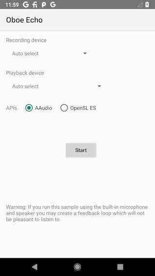

LiveEffect Sample
============

This sample simply loops audio from input stream to output stream to demonstrate
the usage of the 2 stream interfaces.

Screenshots
-----------

### Stream Configurations
- 48kHz
- oboe::I16
- stereo or mono

### Caveats
When first time starting audio devices, the stream may not be stable.
The symptom is the strange callback pattern. This sample waits half a second
for audio system to stablize. It is an estimate, it would vary on different platforms.

