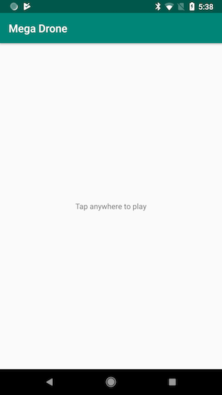

Mega Drone
==========
Ever wondered what 100 square waves sound like when played together? Well now you can find out! 

Mega Drone is an app which creates 100 oscillators, combines their output in a mixer and plays the resulting sound. 

This sample demonstrates how to obtain the lowest latency by: 

1) Leaving Oboe to choose the best default stream properties for the current device
2) Setting performance mode to LowLatency
3) Setting sharing mode to Exclusive
4) Setting the buffer size to 2 bursts

This code was presented at [AES Milan](http://www.aes.org/events/144/) as part of a live coding demonstration. 

The [following article explaining how to debug CPU performance problems](https://medium.com/@donturner/debugging-audio-glitches-on-android-ed10782f9c64) may also be useful when looking at this code 

Implementation details
---
The stream properties are left to Oboe as such the app must output audio data in a format which matches that of the stream. 

Four different formats are supported: 

|Channel count|Format|
|-------------|------|
|1 - Mono|16-bit int|
|2 - Stereo|16-bit int|
|1 - Mono|Float|
|1 - Stereo|Float|

The signal chain for mono streams is: 

    Oscillators->Mixer

For stereo chains a mono to stereo converter is added to the end of the chain: 

    Oscillators->Mixer->MonoToStereo
 
The compiler optimization flag `-Ofast` can be found in [CMakeLists.txt](CMakeLists.txt). 
 
Screenshots
-----------
