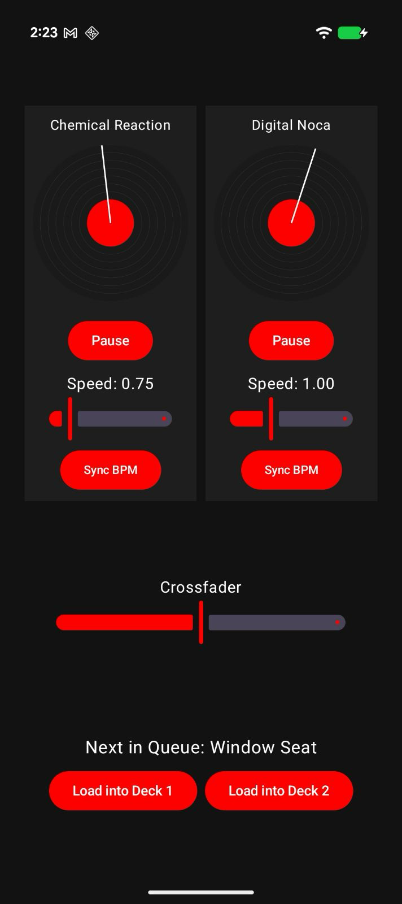

# OboeDJ Sample

A high-performance, low-latency DJ sample application using the Oboe library. It features two independent playback decks, real-time audio scratching, and a Jetpack Compose UI.

## Features

-   **Dual Playback Decks**: Play two tracks simultaneously.
-   **Audio Scratching**: Interactive vinyl wheels allow you to scratch audio in real-time.
-   **BPM Synchronization**: Automatically sync the tempo of one deck to the other.
-   **Track Queueing**: Load a third track into either deck dynamically.
-   **Crossfader**: Smoothly mix between the left and right decks.

## UI Overview

-   **Vinyl Wheels**: Tap and drag to scratch. Release to resume normal playback.
-   **Play/Pause Buttons**: Control playback for each deck.
-   **Speed Sliders**: Adjust playback speed multiplier (0.5x to 2.0x).
-   **Sync BPM Button**: Automatically calculates and sets the speed multiplier to match the other deck's tempo.
-   **Crossfader**: Located at the bottom to mix between decks.
-   **Queue Console**: Load the next track ("Window Seat") into Deck 1 or Deck 2.

## Technical Details

-   **Engine**: C++ `DJEngine` managing Oboe streams and mixing.
-   **Interpolation**: `SoundPlayer` uses linear interpolation for smooth variable speed and reverse playback.
-   **State Management**: Jetpack Compose state hoisting for synchronized UI/Audio engine states.

Images
-----------
