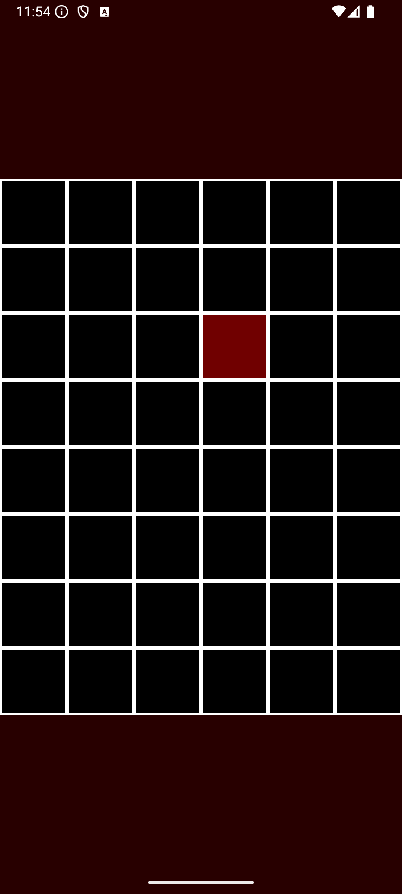

Soundboard
==========
Do you want to just jam with some digital tunes? Now you can!

This sample demonstrates how to obtain the lowest latency and optimal computational throughput by:

1) Leaving Oboe to choose the best default stream properties for the current device
2) Setting performance mode to LowLatency
3) Setting sharing mode to Exclusive
4) Setting the buffer size to 2 bursts
5) Using the `-Ofast` compiler optimization flag, even when building the `Debug` variant

The [following article explaining how to debug CPU performance problems](https://medium.com/@donturner/debugging-audio-glitches-on-android-ed10782f9c64) may also be useful when looking at this code.

Implementation details
---
The stream properties are left to Oboe as such the app must output audio data in a format which matches that of the stream. 

Four different formats are supported: 

|Channel count|Format|
|-------------|------|
|1 - Mono|16-bit int|
|2 - Stereo|16-bit int|
|1 - Mono|Float|
|2 - Stereo|Float|

The signal chain for mono streams is: 

    SynthSound->Mixer

For stereo chains a mono to stereo converter is added to the end of the chain: 

    SynthSound->Mixer->MonoToStereo
 
The compiler optimization flag `-Ofast` can be found in [CMakeLists.txt](CMakeLists.txt). 

Each SynthSound is a series of 5 Oscillators, creating a pleasant sounding note when combined.

There are 30 notes, corresponding to G3 to C6, moving left to right, top to bottom.

In order to determine whether a note should be played, MusicTileView demonstrates how to keep track of where each finger is.

Images
-----------

