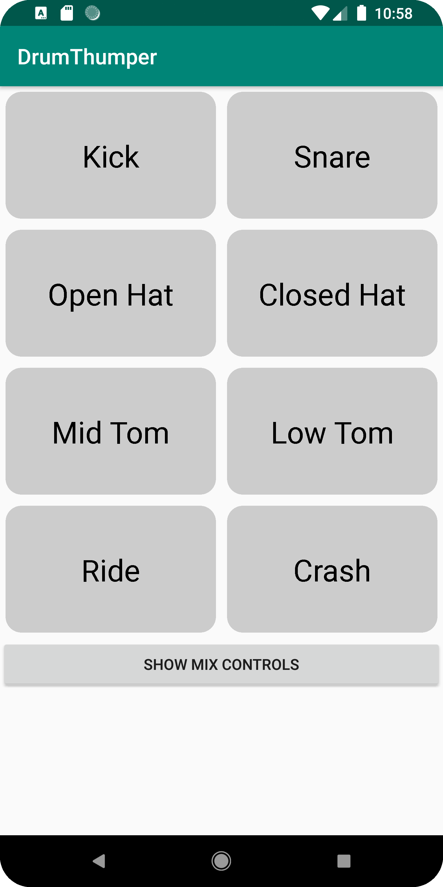

**DrumThumper**
==========
Oboe playback sample app.

## Abstract
**DrumThumper** is a "Drum Pad" app which demonstrates best-practices for low-latency audio playback using the Android **Oboe** API.
**DrumThumper** consists of a set of trigger pad widgets and an optional UI for controlling the level and stereo placement of each of the virtual drums.
The audio samples are stored in application resources as WAV data. This is parsed and loaded (by routines in **parselib**) into memory blocks.
The audio samples are mixed and played by routines in **iolib**.

**DrumThumper** is written in a combination of Kotlin for the UI and JNI/C++ for the player components (to demonstrate accessing native code from a Kotlin or Java application).

## Scope
**DrumThumper** is designed with the following goals in mind:
* To demonstrate the most efficient means of playing audio with the lowest possible latency.
* To demonstrate how to play multiple sources of audio mixed into a single Oboe stream.
* To demonstrate the life-cycle of an Oboe audio stream and it's relationship to the application lifecycle.
* To demonstrate the correct handling of playback errors and output device connection/disconnection.

Secondarily, **DrumThumper** demonstrates:
* Using Android "assets" for audio data.
* The mechanism for calling native (C/C++) audio functionality from a Kotlin/Java app.
* A mechanism for sharing binary data between a Kotlin/Java app with the native (C/C++) layer.
* A mechanism for parsing/loading one type (WAV) of audio data.
* How to control the relative levels (gain) of audio sources mixed into an output stream.
* How to locate a mono data source in a stereo output stream.
* How to use the Oboe resampler to resample source audio to the device playback rate, and therefore not incur this overhead at playback time.

To keep things simple, **DrumThumper** specifically does not:
* Does not support audio samples in other than 16-bit PCM Samples. It does not support different PCM formats.
* Does not support non-WAV audio data (such as AIFF).
* Does not support compressed audio data.

**DrumThumper** now supports different sample rates for the source samples.

**DrumThumper** now supports mono and stereo sources.

## DrumThumper project structure
### Kotlin App Layer
Contains classes for the application logic and defines the methods for accessing the native data and player functionality.

### Native (C++) layer
Contains the implementation of the `native` (JNI) methods defined in the `DrumPlayer` (Kotlin) class.

### Dependent Libraries
* **iolib**
Classes for playing audio data.

* **parselib**
Classes for parsing and loading audio data from WAV resources.

## App
* DrumPlayer.kt
The Kotlin class which provides the audio playback functionality by interfacing with the native (C++) libraries.

* DrumThumperActivity.kt
The main application logic.

* TriggerPad.kt
An Android View subclass which implements the "trigger pad" UI widgets

## Native-interface (JNI)
* DrumPlayerJNI.cpp
 This is where all the access to the native functionality is implemented.

## Screenshots

