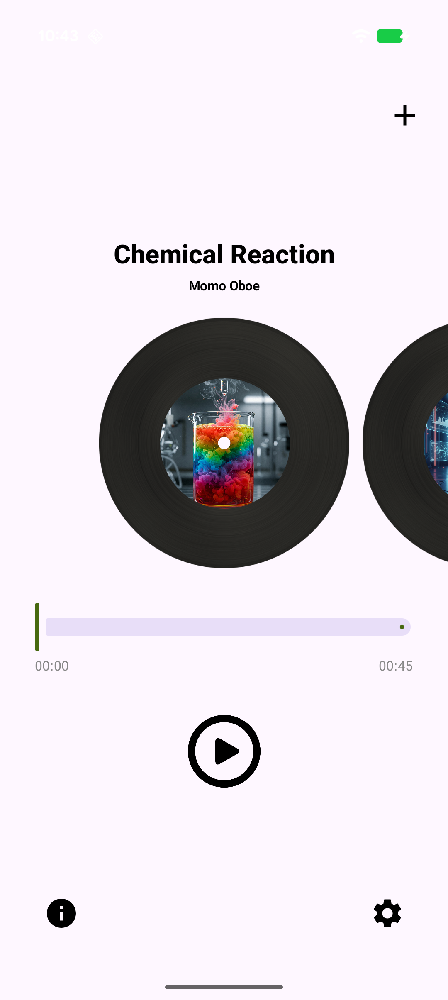
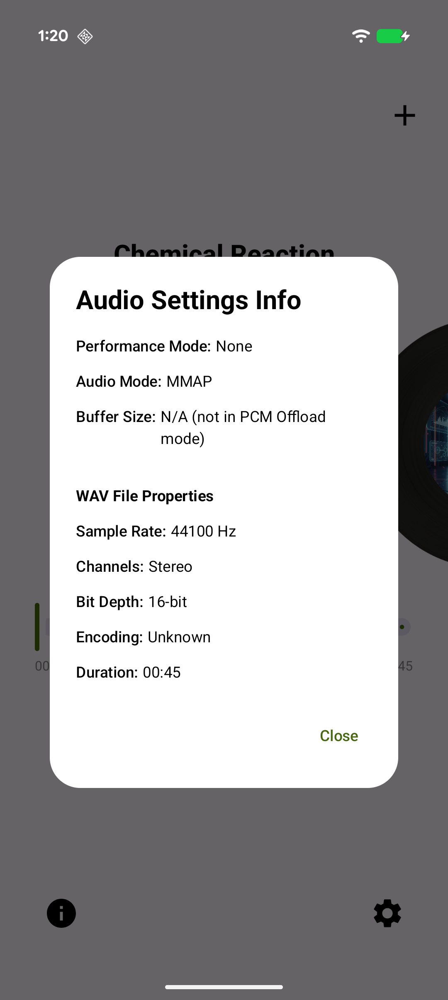
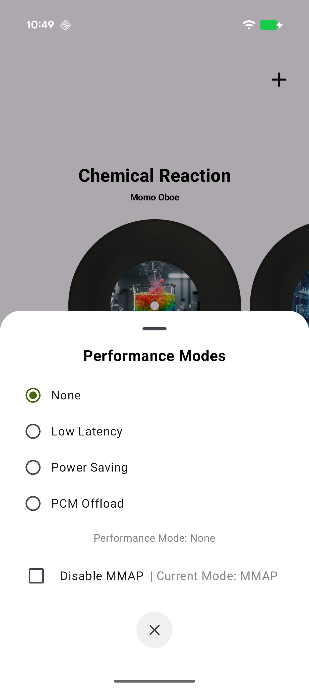

# PowerPlay Sample

An energy-efficient audio player sample application demonstrating the use of the Performance Modes in Oboe library. It showcases different audio performance modes, including low-latency, power-saving, and hardware PCM offload, wrapped in a modern Jetpack Compose UI.

## Features
-   **Performance Modes**: Switch between None, Low Latency, Power Saving, and hardware PCM Offload playback modes.
-   **PCM Offload**: Support for hardware PCM Offloaded playback to dramatically reduce power consumption for continuous playback.
-   **Audio API Selection**: Toggle between MMAP and Classic audio pathways.
-   **Dynamic Playback**: Play bundled audio tracks or load custom local WAV files from your device.
-   **Intent Automation**: Support for automation via ADB intents to control playback, modes, and configurations programmatically.
-   **Foreground Service**: Ensures uninterrupted audio playback while the app is in the background or the screen is off.

## UI Overview
-   **Play/Pause Button**: Controls playback for the current track.
-   **Seek Bar**: Adjust the current playback position. Only available in non-offload modes.
-   **Settings Bottom Sheet**: Configure performance modes (Low Latency, Power Saving, PCM Offload), adjust requested buffer size in frames, and toggle MMAP.
-   **Info Dialog**: View details about the current audio mode, WAV file properties (Sample Rate, Channels, Bit Depth, Duration), and actual buffer size.
-   **Add Local File**: Load custom WAV files directly from your device storage to add to your queue.

## Technical Details
-   **Engine**: C++ `PowerPlayMultiPlayer` managing Oboe streams, buffer sizing, and performance configurations.
-   **Audio Format**: Uses Float PCM audio encoding with stereo output.
-   **Automation**: `IntentBasedTestSupport` allows programmatic control via Android Intents for robust testing. For more information, see the [Automation Guide](QuickStart_Automation.md).
-   **State Management**: Jetpack Compose manages the UI states and synchronizes them with the underlying C++ audio engine.

Images
-----------

  
  
  

